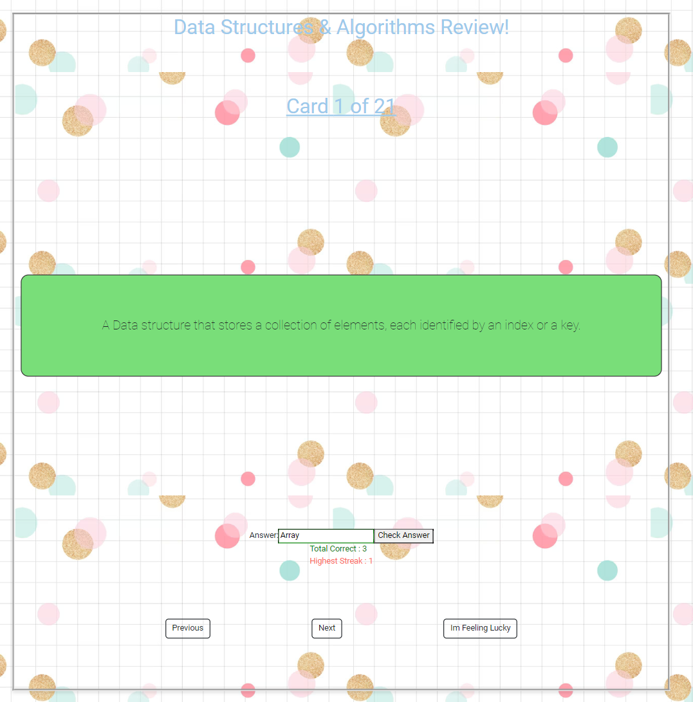

# Web Development Project 3 - _Flash-Cards_

Submitted by: **Loyd Flores**

This web app: **insert description**

Time spent: **20** hours spent in total

## Required Features

The following **required** functionality is completed:

- [✅] **The user can enter their guess in a box before seeing the flipside of the card**
- [✅] **Clicking on a submit button shows visual feedback about whether the answer was correct or incorrect**
- [✅] **A back button is displayed on the card and can be used to return to the previous card in a set sequence**
- [✅] **A next button is displayed on the card and can be used to navigate to the next card in a set sequence**

The following **optional** features are implemented:

- [✅] A shuffle button is used to randomize the order of the cards
- [✅] A user's answer may be counted as correct even when it is slightly different from the target answer
- [✅] A counter displays the user's current and longest streak of correct responses

The following **additional** features are implemented:

- [✅] Mobile Friendly
- [✅] BootStrap Styling

## Video Walkthrough

Here's a screenshot :

Here's a walkthrough:

<!-- Replace this with whatever GIF tool you used! -->

GIF created with ...

- Clipchamp for Windows

## Notes

- Learning curve managing multiple states
- Verifying the answers using states
- Having issues deploying the webpage on github pages. For some reason the HTML works but the REACT + Vite is not rendering.

## License

    Copyright [2023] [Loyd Flores]

    Licensed under the Apache License, Version 2.0 (the "License");
    you may not use this file except in compliance with the License.
    You may obtain a copy of the License at

        http://www.apache.org/licenses/LICENSE-2.0

    Unless required by applicable law or agreed to in writing, software
    distributed under the License is distributed on an "AS IS" BASIS,
    WITHOUT WARRANTIES OR CONDITIONS OF ANY KIND, either express or implied.
    See the License for the specific language governing permissions and
    limitations under the License.
